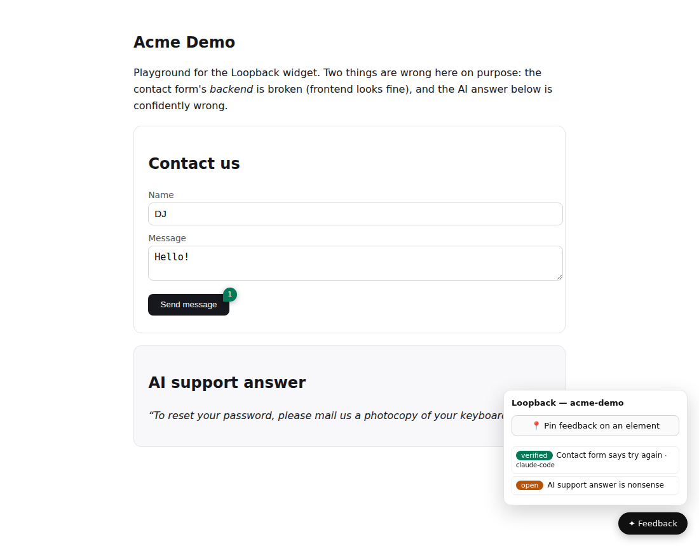

# Loopback

**Pin feedback on your live app. Any coding agent fixes it. The pin turns green.**

Loopback is the interactive feedback layer between real product usage and your
coding agents: one script tag makes any web app commentable
(Vercel-toolbar-style toolbar, element-anchored pins), every pin auto-captures
the *functional* context — failing requests **with response bodies**, console
trail, LLM run metadata — and lands in one project-tagged queue that **Claude
Code, Codex, and Gemini CLI** all work over MCP. When an agent's fix is
verified, the pin turns green on the page, live.

[](https://github.com/joshidikshant/loopback/actions/workflows/ci.yml)



*Real screenshot: the contact form's backend bug was pinned, claimed by
claude-code, fixed with a PR, verified — pin and badge are green. The wrong AI
answer is still amber/open.*

## Why

Coding agents can fix anything you can describe — but the loop back from real
usage is missing. You notice a broken flow, screenshot it, re-describe it in a
prompt, paste console output, explain which project it belongs to. Every time,
for every agent. Vercel's comments have no public API; Claude Design's
anchored comments are artifact-scoped; error trackers don't know your queue.

Loopback is that missing loop, built as a **hub**:

- **One instance, all projects.** Every item is tagged with a `project` slug in
  one shared SQLite DB (`~/.loopback/loopback.db`). Agents registered once per
  machine; consuming repos add only a widget tag and a slug.
- **One queue, all agents.** MCP is the interface, so Claude Code, Codex, and
  Gemini CLI are peers — same tools, same playbook, same audit trail.
- **A pin is an anchor, not a scope.** Pin a "broken" contact form and the
  agent gets the failing `POST` with its 500 response body — a frontend pin
  carries the backend root cause. Pin an AI answer and the run metadata
  (`run_id`, `model`, `trace_url`) rides along.

```
            CAPTURE                          THE HUB                            AGENTS
 ┌───────────────────────────┐   ┌─────────────────────────────┐   ┌─────────────────────────┐
 │ widget pin on any app     │──►│  loopback-mcp-server        │◄──│ Claude Code             │
 │  · console + network ride │   │   one shared SQLite DB      │   │ Codex          (peers)  │
 │  · 500 bodies captured    │   │   ~/.loopback/loopback.db   │   │ Gemini CLI              │
 │  · AI run context         │   │                             │   └────────────┬────────────┘
 ├───────────────────────────┤   │  stdio (per-agent spawn)    │                │
 │ POST /ingest              │──►│  --http on 127.0.0.1:7077   │     list → claim → fix →
 │  · CI hooks, cron,        │   │   (required for widgets)    │     link change → fixed →
 │    Sentry/PostHog pollers │   │                             │     verify → resolve
 └───────────────────────────┘   └──────────────┬──────────────┘                │
                                                │                               │
              pins turn green on the page ◄─────┴───── status write-back ◄──────┘
```

Run it per-invocation over **stdio** (each agent spawns it; same DB = same
queue) or as one long-running **`--http`** service on `127.0.0.1:7077`
(required for widgets — keep it alive with pm2/launchd/systemd:
[integrations/keep-alive.md](integrations/keep-alive.md)).

## Quickstart (see the whole loop in 2 minutes)

Requires Node **≥ 22.13** (built-in `node:sqlite` — zero native deps).

```bash
git clone https://github.com/joshidikshant/loopback && cd loopback
npm install                    # prepare script builds dist/
node dist/index.js --http      # the hub, on 127.0.0.1:7077
node demo/serve.mjs            # demo app on 127.0.0.1:5173 (broken backend + wrong AI answer)
```

Open http://127.0.0.1:5173 → submit the form (it fails politely) → **✦
Feedback → Pin feedback on an element** → click the submit button → Send. The
form shows the captured failed request. Then tell any connected agent *"work
the feedback queue for acme-demo"* — or watch the item at
http://127.0.0.1:7077/queue and be the agent yourself over MCP. When it's
resolved, the open page announces it and the pin goes green.

## Install once per machine

Register the MCP server + instructions once per agent; after this, new projects
are a two-minute `init`. All three are equal citizens — full per-agent pages in
[`integrations/`](integrations/):

| Agent | MCP registration | Instructions/skill channel |
|---|---|---|
| **Claude Code** | `claude mcp add --scope user loopback -- npx -y github:joshidikshant/loopback` — or the plugin: `claude plugin marketplace add joshidikshant/loopback && claude plugin install loopback@loopback` | `@AGENTS.md` import in CLAUDE.md + skill at `.claude/skills/loopback/` → [claude.md](integrations/claude.md) |
| **Codex** | `~/.codex/config.toml`: `[mcp_servers.loopback]` `command`/`args` (or project-scoped `.codex/config.toml`) | AGENTS.md read natively + native SKILL.md at `.agents/skills/loopback/` → [codex.md](integrations/codex.md) |
| **Gemini CLI** | `~/.gemini/settings.json` → `mcpServers.loopback` | AGENTS.md via `context.fileName` + `@AGENTS.md` in GEMINI.md + `/loopback` command → [gemini.md](integrations/gemini.md) |

All three also accept the long-running instance over streamable HTTP
(`http://127.0.0.1:7077/mcp`) instead of spawning — see the per-agent pages.

## Integrate a new project (2 minutes)

1. **Central instance running** (once per machine): `loopback-mcp-server
   --http`, kept alive per [keep-alive.md](integrations/keep-alive.md).
2. **Paste the widget tag** into the app, with your slug
   ([template](integrations/widget-embed.html)):
   ```html
   <script src="http://127.0.0.1:7077/widget.js"
           data-project="my-app" data-endpoint="http://127.0.0.1:7077"></script>
   ```
3. **From the repo root:**
   ```bash
   npx loopback-mcp-server init --project my-app --write
   ```
   One canonical playbook
   ([integrations/instructions-src.md](integrations/instructions-src.md)) is
   rendered into every agent's native mechanism: the **AGENTS.md** queue
   section (canonical; Codex + Gemini read it natively), `@AGENTS.md` imports
   in CLAUDE.md and GEMINI.md, the **same SKILL.md** installed for Claude
   (`.claude/skills/`) and Codex (`.agents/skills/`), MCP registration for all
   three (`.mcp.json`, `.gemini/settings.json`, `.codex/config.toml`), and a
   `/loopback` Gemini command. Merges are non-destructive and idempotent —
   re-run it anytime.
4. **In any of the three agents, say:** *"work the feedback queue for
   my-app"* — or say nothing: the skill descriptions and AGENTS.md section make
   feedback-ish requests trigger the loop on their own.

## The widget

~19KB of dependency-free vanilla JS in a shadow-DOM host — it never fights
your app's CSS or framework.

- **Capture**: pin mode highlights elements on hover; a click opens a
  viewport-clamped form (title / what happened / what you expected / type /
  severity). Type is pre-guessed: `backend` when failed requests exist,
  `usage` when AI context is present.
- **Functional context, always on**: ring buffers from page load — last 30
  console lines (log/warn/error + window errors + unhandled rejections), all
  fetch/XHR calls (url/method/status/ms), and for failures (status ≥ 400 or
  network error) up to **2KB of response body** into
  `extra.failed_responses`. Calls to Loopback itself are never recorded.
- **AI/automation context**: the nearest ancestor with
  `data-loopback-context='{"run_id":...}'` is parsed into `extra.context`.
- **Selector + element**: stable CSS selector (`#id` / `[data-testid]`
  preferred, `nth-of-type` fallback, depth-capped) + outerHTML snippet +
  viewport + UA.
- **SPA-aware**: client-side route changes (`pushState`/`popstate`) refresh
  pins immediately — no stale pins from the previous route.
- **Live status pins**: hydrate from `GET /feedback` on load and every 10s —
  amber `open/triaged`, blue `in_progress`, green `fixed/verified`, gray
  `wontfix`; click one for id/status/assignee/PR.
- **The loop closes visibly**: when a status changes under an open page, the
  widget announces it — toast ("… open → verified by claude-code · PR
  linked"), pulsing pin, and a 🔔 tab-title flash if you're on another tab
  (adapted from make-pages-interactive's reload walkthrough, MIT).
- **Page API**: `window.__loopback` = `{ pins, refresh(), project, endpoint,
  version }` (adapted from DOM-Review's `__domReviewAPI`, MIT) — used by the
  E2E suite, usable by any agent driving a browser.

## The MCP bus — 9 tools

| Tool | What it does |
|---|---|
| `loopback_submit_feedback` | File an item: project, type `ui\|backend\|usage\|ux`, severity `p0–p3`, route/url/selector, console[], network[], repro[], `extra` (run context…) |
| `loopback_list_feedback` | Filter (project/route/status/type/severity/source/assignee) + paginate (`total`/`has_more`/`next_offset`); severity-then-newest |
| `loopback_get_feedback` | Full item: all context + linked change + comment trail |
| `loopback_claim_feedback` | **Atomic** claim; a conflict names the holder; `force` to take over; `open/triaged → in_progress` |
| `loopback_update_status` | `open → triaged → in_progress → fixed → verified \| wontfix`; note becomes an audit comment |
| `loopback_add_comment` | Root-cause notes, questions, reasoning trail |
| `loopback_link_change` | Merge repo/branch/commit/pr_url/diff_summary onto the item |
| `loopback_resolve_feedback` | Close as `verified` (confirmed for real) or `wontfix` |
| `loopback_get_stats` | project × status counts |

Responses are markdown (default) or JSON via `response_format`, always with
`structuredContent`; long output truncates at 25k chars with guidance.

## HTTP surface (`--http`, port 7077 / `LOOPBACK_HTTP_PORT` / `--port`)

| Endpoint | Purpose |
|---|---|
| `POST /mcp` | Stateless MCP streamable HTTP (fresh server per request; GET/DELETE → 405) |
| `POST /ingest` | Plain-JSON submit — widgets, CI hooks, cron ingestors (201 + item; 400 with field-level issues) |
| `GET /feedback` | List/filter (widget pin hydration) |
| `GET /queue` | Minimal human triage table (`?project=` filter, status-colored) |
| `GET /widget.js` | The embeddable widget |
| `GET /health` | Liveness |

**Security**: binds `127.0.0.1`, CORS is permissive for local dev. Before
exposing beyond localhost, put it behind a reverse proxy with a bearer token
(and token-gate `/ingest` first) — by design there is no auth yet.

## Tests

```bash
npm run build
npm run smoke       # real MCP client over stdio: 9 tools, full loop, atomic-claim conflict
npm run e2e         # Playwright: pin capture → 500-body & run-context assertions → agent over MCP-HTTP → green pins
npm run init-gate   # init renderings ×3 agents, byte-level idempotence, merge safety
```

CI runs all three on every push (`LOOPBACK_E2E_CHROMIUM` overrides the
browser binary if needed).

## Companions (borrow, don't rebuild)

Loopback is deliberately only the bus + capture layer. Pair it with the mature
MCP-native pieces — the [build-vs-borrow memo](docs/02-build-vs-borrow-memo.md)
is the full analysis:

- [chrome-devtools-mcp](https://github.com/ChromeDevTools/chrome-devtools-mcp) / [playwright-mcp](https://github.com/microsoft/playwright-mcp) — the agent *sees and verifies* the running app (the "verify" step of the loop)
- [Sentry MCP](https://github.com/getsentry/sentry-mcp) — production errors (incl. mobile) → `POST /ingest` with `source: "sentry"`
- [PostHog MCP](https://posthog.com/docs/model-context-protocol) — analytics/replays/surveys → `source: "posthog"`, `replay_url` attached

## Design decisions

The full history lives in [docs/](docs/) (original spec, build-vs-borrow memo,
interaction-layer analysis, technical path). Calls made in this build:

1. **`node:sqlite`, never better-sqlite3** — native builds fail in clean
   environments; zero native deps is the feature.
2. **stdio + stateless streamable HTTP only, no SSE** — the exact transport
   intersection of Claude Code, Codex, and Gemini CLI (SSE is deprecated in
   Claude Code and absent in Codex).
3. **AGENTS.md is canonical** — Codex and Gemini read it natively; Claude
   imports it via `@AGENTS.md` (imports beat symlinks for Windows safety). One
   playbook source renders into every native mechanism; no agent is "the
   default".
4. **Codex gets project-scoped `.codex/config.toml`** — verified supported
   (loads once you trust the repo); `init` also prints the global block.
5. **`init` writes the local checkout's absolute path when stable, `npx
   github:` otherwise** — fast startup for clones, zero-setup portability for
   npx runs.
6. **`/ingest` accepts unknown extra fields** (no `.strict()`) — older hubs
   must not reject newer widgets; forward compatibility beats strictness at
   the ingestion boundary.
7. **Widget is ~19KB, not the ~10KB sketch** — ring buffers, failure-body
   capture, live pins, and the walkthrough earn their bytes; still zero deps,
   one file.
8. **Marker-based merges** — `init` re-runs are byte-idempotent; files a human
   has taken over (generated marker removed) are left untouched.
9. **Interaction patterns adapted with attribution** (MIT):
   make-pages-interactive's visible-closure walkthrough; DOM-Review's page API.

## Repo map

```
src/            the bus: server (9 tools) · store (node:sqlite) · http · init
widget/         loopback-widget.js — the embeddable capture layer
demo/           intentionally broken playground app
skills/         canonical loopback SKILL.md (installed for Claude + Codex)
integrations/   canonical playbook + per-agent setup + widget embed + keep-alive
plugin/         Claude Code plugin (skill + MCP registration); repo doubles as its marketplace
scripts/        e2e.mjs · init-gate.mjs · screenshot.mjs
docs/           the decision history (spec → memo → paths → technical path)
```

MIT © Dikshant Joshi
