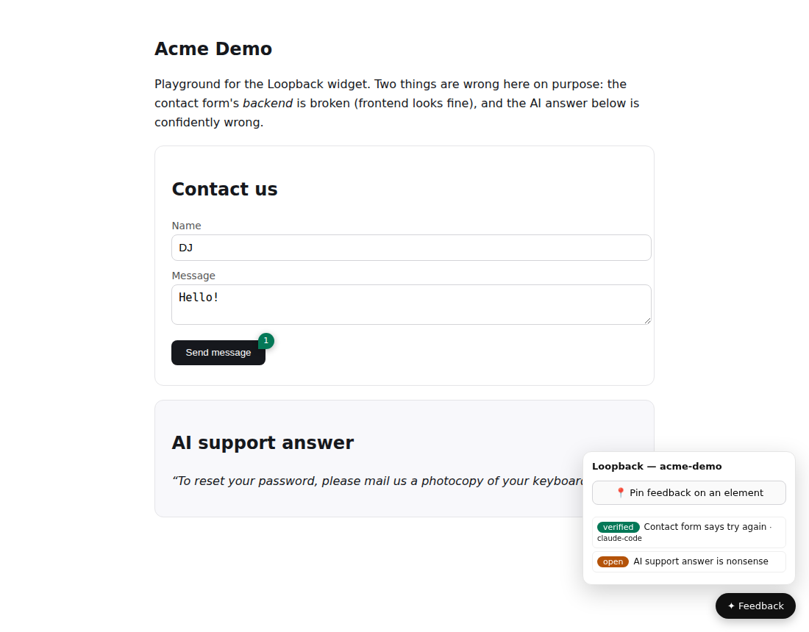

# Loopback

**Pin feedback on the app you're building. Any coding agent claims it. The pin turns green when the fix is verified.**

Loopback is the interactive feedback layer between real product usage and your
coding agents: one script tag makes the app you're running locally commentable
(Vercel-toolbar-style toolbar, element-anchored pins; deployed public sites go
via the `/ingest` rails instead — see [surface compatibility](docs/05-surface-compatibility.md)), every pin auto-captures
the *functional* context — failing requests **with response bodies**, console
trail, the route journey that led there, LLM run metadata, typed repro steps —
and lands in one project-tagged queue that **Claude
Code, Codex, and Gemini CLI** all work over MCP. When an agent's fix is
verified, the pin turns green on the page, live.

[](https://github.com/joshidikshant/loopback/actions/workflows/ci.yml)



*Seeded demo capture (generated by `scripts/screenshot.mjs`): the contact form's
backend bug pinned, claimed by claude-code, marked fixed with a linked change,
verified — pin and badge green. The wrong AI answer is still amber/open.*

## Why

Coding agents can fix anything you can describe — but the loop back from real
usage is missing. You notice a broken flow, screenshot it, re-describe it in a
prompt, paste console output, explain which project it belongs to. Every time,
for every agent. Vercel's comments have no public API; Claude Design's
anchored comments are artifact-scoped; error trackers don't know your queue.

Loopback is that missing loop, built as a **hub**:

- **One instance, all projects.** Every item is tagged with a `project` slug in
  one shared SQLite DB (`~/.loopback/loopback.db`). Agents registered once per
  machine; consuming repos add only a widget tag and a slug.
- **One queue, all agents.** MCP is the interface, so Claude Code, Codex, and
  Gemini CLI are peers — same tools, same playbook, same audit trail.
- **A pin is an anchor, not a scope.** Pin a "broken" contact form and the
  agent gets the failing `POST` with its 500 response body — a frontend pin
  carries the backend root cause. Pin an AI answer and the run metadata
  (`run_id`, `model`, `trace_url`) rides along.

```
            CAPTURE                          THE HUB                            AGENTS
 ┌───────────────────────────┐   ┌─────────────────────────────┐   ┌─────────────────────────┐
 │ widget pin on any app     │──►│  loopback-mcp-server        │◄──│ Claude Code             │
 │  · console + network ride │   │   one shared SQLite DB      │   │ Codex          (peers)  │
 │  · 500 bodies captured    │   │   ~/.loopback/loopback.db   │   │ Gemini CLI              │
 │  · AI run context         │   │                             │   └────────────┬────────────┘
 ├───────────────────────────┤   │  stdio (per-agent spawn)    │                │
 │ POST /ingest              │──►│  --http on 127.0.0.1:7077   │     list → claim → fix →
 │  · CI hooks, cron,        │   │   (required for widgets)    │     link change → fixed →
 │    Sentry/PostHog pollers │   │                             │     verify → resolve
 └───────────────────────────┘   └──────────────┬──────────────┘                │
                                                │                               │
              pins turn green on the page ◄─────┴───── status write-back ◄──────┘
```

Run it per-invocation over **stdio** (each agent spawns it; same DB = same
queue) or as one long-running **`--http`** service on `127.0.0.1:7077`
(required for widgets — keep it alive with pm2/launchd/systemd:
[integrations/keep-alive.md](integrations/keep-alive.md)).

## Quickstart (see the whole loop in 2 minutes)

Requires Node **≥ 22.13** (built-in `node:sqlite` — zero native deps).

```bash
git clone https://github.com/joshidikshant/loopback && cd loopback
npm install                    # prepare script builds dist/
node dist/index.js --http      # the hub, on 127.0.0.1:7077
node demo/serve.mjs            # demo app on 127.0.0.1:5173 (broken backend + wrong AI answer)
```

Open http://127.0.0.1:5173 → submit the form (it fails politely) → **✦
Loopback → Pin feedback on an element** → click the submit button → Send. The
form shows the captured failed request. Then tell any connected agent *"work
the feedback queue for acme-demo"* — or watch the item at
http://127.0.0.1:7077/queue and be the agent yourself over MCP. When it's
resolved, the open page announces it and the pin goes green.

## Install once per machine

Register the MCP server + instructions once per agent; after this, new projects
are a two-minute `init`. All three are equal citizens — full per-agent pages in
[`integrations/`](integrations/):

| Agent | MCP registration | Instructions/skill channel |
|---|---|---|
| **Claude Code** | `claude mcp add --scope user loopback -- npx -y loopback-mcp-server` — or the plugin: `claude plugin marketplace add joshidikshant/loopback && claude plugin install loopback@loopback` | `@AGENTS.md` import in CLAUDE.md + skill at `.claude/skills/loopback/` → [claude.md](integrations/claude.md) |
| **Codex** | `~/.codex/config.toml`: `[mcp_servers.loopback]` `command`/`args` (or project-scoped `.codex/config.toml`) | AGENTS.md read natively + native SKILL.md at `.agents/skills/loopback/` → [codex.md](integrations/codex.md) |
| **Gemini CLI** | `~/.gemini/settings.json` → `mcpServers.loopback` | AGENTS.md via `context.fileName` + `@AGENTS.md` in GEMINI.md + `/loopback` command → [gemini.md](integrations/gemini.md) |

All three also accept the long-running instance over streamable HTTP
(`http://127.0.0.1:7077/mcp`) instead of spawning — see the per-agent pages.

## Integrate a new project (2 minutes)

1. **Central instance running** (once per machine): `loopback-mcp-server
   --http`, kept alive per [keep-alive.md](integrations/keep-alive.md).
2. **Paste the widget tag** into the app, with your slug
   ([template](integrations/widget-embed.html)):
   ```html
   <script src="http://127.0.0.1:7077/widget.js"
           data-project="my-app" data-endpoint="http://127.0.0.1:7077"></script>
   ```
3. **From the repo root:**
   ```bash
   npx loopback-mcp-server init --project my-app --write
   ```
   One canonical playbook
   ([integrations/instructions-src.md](integrations/instructions-src.md)) is
   rendered into every agent's native mechanism: the **AGENTS.md** queue
   section (canonical; Codex + Gemini read it natively), `@AGENTS.md` imports
   in CLAUDE.md and GEMINI.md, the **same SKILL.md** installed for Claude
   (`.claude/skills/`) and Codex (`.agents/skills/`), MCP registration for all
   three (`.mcp.json`, `.gemini/settings.json`, `.codex/config.toml`), and a
   `/loopback` Gemini command. Merges are non-destructive and idempotent —
   re-run it anytime.
4. **In any of the three agents, say:** *"work the feedback queue for
   my-app"* — or say nothing: the skill descriptions and AGENTS.md section make
   feedback-ish requests trigger the loop on their own.

## Using it day to day

With the hub running (`loopback-mcp-server --http`), everything happens on two
surfaces and one sentence to an agent:

| I want to… | Do this |
|---|---|
| **Report something** on a page with the widget | Click **✦ Loopback → Pin feedback on an element**, click the thing, describe it. Failing requests, console, and AI run context attach themselves. |
| **See the queue** | `http://127.0.0.1:7077/queue` — filter with `?project=<slug>`, click a row for a quick read |
| **Read everything on one item** | Click its id → `http://127.0.0.1:7077/queue/<id>`. Deep-linkable: paste it to a teammate or an agent. |
| **Comment or change status myself** | On the item view — plain forms, no agent needed |
| **Get it fixed** | In the repo, tell any agent: *"work the feedback queue for `<slug>`"* |
| **Watch it close** | The pin on your page turns green and announces itself; the item shows the commit/PR |
| **File from a script or CI** | `POST /ingest` with `{"project","type","title","body"}` |

Writes that change an item (comment, status) are **same-origin only** — see
[Security](#http-surface---http-port-7077--loopback_http_port---port) below.

## Giving feedback *about* Loopback

Loopback is its own reference integration — it eats its own dog food, and so
can you. Four ways in, from most to least convenient:

1. **Pin it on the queue page.** With the hub running, open
   `http://127.0.0.1:7077/queue` — the capture widget is embedded there with
   `data-project=loopback`. Click **✦ Loopback → Pin feedback on an element**,
   click whatever is wrong, describe it. Same loop as any other project.
2. **Tell an agent.** In this repo (self-onboarded with its own `init`), say
   *"file feedback for loopback: <what's wrong>"* — the skill and AGENTS.md
   section are already installed for Claude, Codex, and Gemini.
3. **`curl` it** from anywhere:
   ```bash
   curl -X POST http://127.0.0.1:7077/ingest -H 'Content-Type: application/json' \
     -d '{"project":"loopback","type":"ux","severity":"p2",
          "title":"…","body":"what happened / what you expected"}'
   ```
4. **GitHub issues** for anything a stranger should see:
   <https://github.com/joshidikshant/loopback/issues>.

Then work it like any queue: *"work the feedback queue for loopback"*. Every
Loopback defect in this repo's history was filed and closed exactly this way.

## The dashboard

`/queue` is a **React + shadcn app** (`dashboard/`, built with the real `shadcn`
CLI). Filter by clicking status tiles or any project / severity / type cell —
filters compose and live in the URL, so every view is linkable. Open an item to
read everything captured, **edit** it (title, body, severity, type — every change
lands on the audit trail), comment, change status, and **attach files**.

Attachments declare *why* they exist, because that decides what an agent does:

| Intent | Meaning |
|---|---|
| **`reference`** | Context for the fix — a screenshot, a spec, a "make it look like this". Read it, then leave it. It never ships. |
| **`asset`** | A deliverable. The blob store is a transfer buffer: the item carries a `target_path` and the agent copies the file into the repo there and commits it. |

Blobs live in `~/.loopback/blobs/<item>/`, beside the DB rather than inside it,
and agents get an **absolute local path** so they copy the file instead of
decoding it out of the protocol.

The build output is **committed** to `public/dashboard/`, so
`npx loopback-mcp-server` still needs no React, no Tailwind and no build step —
the hub just serves files. `npm run dashboard:build` after changing
`dashboard/src`; `dashboard-gate` fails CI if the committed build has drifted.

## Design system (shadcn-compatible, zero dependencies)

Both surfaces — widget and `/queue` — are built from one token set in vanilla
CSS that speaks **shadcn/ui's contract** (oklch variables, `.dark`, the
multiplicative radius scale). No React, no Tailwind, no build step; drop
`design/tokens.css` into any shadcn/v0 project and it themes from that
project's palette. Full rationale and the shadow-DOM isolation rules:
[design/README.md](design/README.md).

Loopback also **publishes a shadcn registry**, so React projects can install
its pieces and the **shadcn MCP** can discover them:

```bash
npx shadcn@latest add https://raw.githubusercontent.com/joshidikshant/loopback/main/public/r/loopback-theme.json
npx shadcn@latest add https://raw.githubusercontent.com/joshidikshant/loopback/main/public/r/loopback-components.json
npx shadcn@latest add https://raw.githubusercontent.com/joshidikshant/loopback/main/public/r/loopback-widget.json
```

Three items:

- **`loopback-theme`** ships the FULL shadcn theme contract (background,
  foreground, primary, muted, ring, radius…) alongside the `--lb-*` feedback
  status/severity tokens, so **installing it replaces your palette**. If you
  only want the Loopback-specific tokens, copy the `--lb-*` block out of
  [`design/tokens.css`](design/tokens.css) instead.
- **`loopback-components`** — vanilla CSS recipes for the shadcn component
  vocabulary (`lb-btn`, `lb-badge`, `lb-card`…), for surfaces that want the
  look without React.
- **`loopback-widget`** drops the capture widget into `public/`.

Register `"@loopback"` in your `components.json` to install by name and let an
agent with the shadcn MCP browse the registry.

## Where it works (surfaces)

The queue is transport-agnostic — the widget is just its richest producer.
Full matrix, native snippets (Swift/Kotlin/C#/shell), and the honest edges:
[docs/05-surface-compatibility.md](docs/05-surface-compatibility.md).

| Surface | Status |
|---|---|
| Web apps **in local dev** (any framework) · browser extensions (bundle the widget file — MV3 forbids remote scripts) · Electron/Tauri · WebViews | ✅ widget: pins + auto-context + green write-back |
| Deployed public sites | ✖ Chrome 142+ blocks a public page from reaching `127.0.0.1`. Use the Sentry/PostHog rails instead. |
| Native macOS/Windows apps · CLIs · CI/cron · agents/automations | ✅ `POST /ingest` or MCP (~10-line debug-menu snippet; status via `/queue`) |
| iOS/Android simulators & emulators | ✅ shared loopback / `adb reverse` |
| iOS/Android physical devices on LAN | ✅ `--host 0.0.0.0` (opt-in; prints a bearer token — trusted networks only) |
| iOS/Android production | ✅ via Sentry/PostHog rails (their SDKs capture; bridge to the queue) |

## The widget

~58KB (19KB gzipped) of dependency-free vanilla JS in a shadow-DOM host — it never fights
your app's CSS or framework.

- **Capture**: pin mode highlights elements on hover; a click opens a
  viewport-clamped form (title / what happened / what you expected / type /
  severity). Type is pre-guessed: `backend` when failed requests exist,
  `usage` when AI context is present.
- **Functional context, always on**: ring buffers from page load keep the last
  30 console lines (log/warn/error + window errors + unhandled rejections) and
  the last 30 fetch/XHR calls (url/method/status/ms); a filed report carries
  the most recent **15 of each**, plus — for failures (status ≥ 400 or network
  error) — up to **2KB of response body** into `extra.failed_responses`. Calls
  to Loopback itself are never recorded.
- **AI/automation context**: the nearest ancestor with
  `data-loopback-context='{"run_id":...}'` is parsed into `extra.context`.
- **Selector + element**: stable CSS selector (`#id` / `[data-testid]`
  preferred, `nth-of-type` fallback, depth-capped) + outerHTML snippet +
  viewport + UA.
- **SPA-aware**: client-side route changes (`pushState`/`popstate`) refresh
  pins immediately — no stale pins from the previous route.
- **Live status pins**: hydrate from `GET /feedback` on load and every 10s —
  amber `open`, deeper amber `triaged`, blue `in_progress`, **pale** green
  `fixed` (an agent says it is done), **full** green `verified` (confirmed
  against the running app), gray `wontfix`. The two greens are deliberately
  different: the pin earning its full colour only at `verified` is the whole
  point, so `fixed` reads as provisional. Click a pin for id/status/assignee/PR.
- **The loop closes visibly**: when a status changes under an open page, the
  widget announces it — toast ("… open → verified by claude-code · PR
  linked"), pulsing pin, and a 🔔 tab-title flash if you're on another tab
  (adapted from make-pages-interactive's reload walkthrough, MIT).
- **Page API**: `window.__loopback` = `{ pins, refresh(), project, endpoint,
  version }` (adapted from DOM-Review's `__domReviewAPI`, MIT) — used by the
  E2E suite, usable by any agent driving a browser.

## The MCP bus — 10 tools

| Tool | What it does |
|---|---|
| `loopback_submit_feedback` | File an item: project, type `ui\|backend\|usage\|ux`, severity `p0–p3`, route/url/selector, console[], network[], repro[], `extra` (run context…) |
| `loopback_list_feedback` | Filter (project/route/status/type/severity/source/assignee) + paginate (`total`/`has_more`/`next_offset`); severity-then-newest |
| `loopback_get_feedback` | Full item: all context + linked change + comment trail |
| `loopback_update_feedback` | Correct an item after filing: title, body, severity, type, project, or route — re-rank a severity, fix a mis-guessed type, move it to the right project |
| `loopback_claim_feedback` | **Atomic** claim; a conflict names the holder; `force` to take over; `open/triaged → in_progress` |
| `loopback_update_status` | `open → triaged → in_progress → fixed → verified \| wontfix`; note becomes an audit comment |
| `loopback_add_comment` | Root-cause notes, questions, reasoning trail |
| `loopback_link_change` | Merge repo/branch/commit/pr_url/diff_summary onto the item |
| `loopback_resolve_feedback` | Close as `verified` (confirmed for real) or `wontfix` |
| `loopback_get_stats` | project × status counts |

Responses are markdown (default) or JSON via `response_format`, always with
`structuredContent`; long output truncates at 25k chars with guidance.

## HTTP surface (`--http`, port 7077 / `LOOPBACK_HTTP_PORT` / `--port`)

| Endpoint | Purpose |
|---|---|
| `POST /mcp` | Stateless MCP streamable HTTP (fresh server per request; GET/DELETE → 405) |
| `POST /ingest` | Plain-JSON submit — widgets, CI hooks, cron ingestors (201 + item; 400 with field-level issues) |
| `GET /feedback` | List/filter (widget pin hydration) |
| `GET /queue/:id` | Full item view — all captured context + comment/status actions |
| `POST /queue/:id/comment` · `POST /queue/:id/status` | Human triage writes (**same-origin only**) |
| `GET /feedback/:id` | One item with its full trail, as JSON |
| `POST /feedback/:id/attachments` | Attach a screenshot or asset to an item (`name`/`intent`/`target` as query params, body is the bytes) |
| `GET /blob/:id/:attachmentId` | Fetch one attachment's bytes |
| `DELETE /feedback/:id/attachments/:attachmentId` | Remove an attachment |
| `GET /widget.js` | The embeddable widget |
| `GET /health` | Liveness |

**Security**: the trust boundary is not "localhost" — a loopback port is
reachable from **every page open in your browser**. So:

- CORS is granted to `POST /ingest`, `GET /feedback` and `GET /widget.js` only
  — the three things the widget genuinely needs from a foreign origin.
- Cross-origin reads get the **pin projection** (id, status, title, assignee,
  selector, PR link). `extra` — captured response bodies, which routinely
  contain auth headers — is never served cross-origin.
- Everything that reads full context or changes state, **including `/mcp`**,
  requires an origin pinned at startup from the bind config. Local tooling that
  sends no `Origin` (curl, MCP clients) still works.
- URLs on items are rendered as links only when they are `http(s)` —
  enforced by `safeHref()` in the dashboard, which resolves the URL and reads
  its protocol. `data:`, `vbscript:` and `file:` render as plain text.

**A non-loopback bind requires a token.** On `127.0.0.1` there is none — it
would protect nothing the OS does not already protect. The moment `--host` /
`LOOPBACK_HOST` widens the bind, the server generates one (or takes
`LOOPBACK_TOKEN`) and prints a `?token=…` URL; the token is accepted once from
the query string, moved into an `HttpOnly` cookie, and stripped from the URL so
it does not persist in history or referrers. Tools send
`Authorization: Bearer <token>`. Comparison is constant-time over a digest, so
neither the value nor its length leaks through timing.

Three endpoints stay open on a LAN bind, deliberately:

| Open | Why |
|---|---|
| `POST /ingest` | The widget runs on a phone against an arbitrary host page and has nowhere to keep a secret. Intake is append-only and rate-limited (60/min per IP, 429 past that): a LAN caller can file noise, not read or change anything, and not fill the disk. |
| `GET /widget.js` | Anything embedded in a served script is readable by anyone who can fetch it. |
| `GET /feedback?view=pins` | The minimum needed to draw pins and show one turn green. A strict projection — no body, console, network, repro steps, comments or attachments — of what is already visible on the page. |

Everything else — the dashboard, full reads, every write, and `/mcp`, which
exposes all ten tools — refuses an unauthenticated caller with 401. The split
is asserted in `scripts/e2e.mjs` in both directions, and
`npm run canary` proves that assertion fails when the check is disabled.

This is a shared secret on a trusted network, not a substitute for real auth.
Before exposing Loopback beyond a LAN, put it behind a reverse proxy.

## Publishing to the MCP Registry

Loopback carries the identity the [official MCP Registry](https://github.com/modelcontextprotocol/registry)
uses to prove package ownership:

| Where | Field | Value |
|---|---|---|
| `package.json` | `mcpName` | `io.github.joshidikshant/loopback` |
| `server.json` | `name` | `io.github.joshidikshant/loopback` |

The registry fetches the **published** npm version metadata and requires
`mcpName` to equal `server.json`'s `name` exactly; GitHub-based authentication
additionally requires the `io.github.<username>/` prefix. `server.json` stays in
the repo and out of the npm tarball — the package only needs to carry `mcpName`.

Because npm versions are immutable, a mismatch costs a version number rather
than a retry. `npm run smoke` therefore asserts all six coupled fields (three
versions, the name pair, the npm identifier) and `npm run canary` proves that
assertion fails when they drift.

To release and submit:

```bash
npm publish --otp=<code>          # 2FA code from your authenticator
mcp-publisher validate            # checks server.json against the live registry
mcp-publisher login github        # opens a browser
mcp-publisher publish             # reads server.json
npm run verify:release            # proves all three channels from a clean dir
```

Run `validate` before `publish` — it checks the manifest against the real
registry without spending an attempt. Run `verify:release` after, and read what
it prints: it installs the published tarball into a clean directory, renders
`init` from it, speaks real MCP to the result, confirms the registry listing
resolves to the version you just shipped, and runs the plugin's own registered
command from an empty directory. Every one of those steps has caught a real bug
that the source-side gates could not see. `description` is capped at **100
characters** and is rejected, not truncated, past it, so `npm run smoke`
asserts that limit locally as well.

## Tests

```bash
npm run build
npm run smoke            # real MCP client over stdio: 10 tools, full loop, atomic-claim conflict
npm run e2e              # Playwright: pin capture → 500-body & run-context assertions → agent over MCP-HTTP → green pins
npm run init-gate        # init renderings ×3 agents, byte-level idempotence, merge safety
npm run registry-gate    # the published shadcn registry still resolves and installs
npm run dashboard-gate   # the committed dashboard build matches dashboard/src
npm run impeccable-gate  # design anti-patterns in the shipped UI (canary-verified)
npm run widget-token-gate # the widget's inlined tokens still equal design/tokens.css
npm run a11y-gate        # contrast, target size, names, landmarks, motion — measured in a browser
```

CI runs all of them on every push (`LOOPBACK_E2E_CHROMIUM` overrides the
browser binary if needed).

Several of these are built to resist passing for the wrong reason, because the
underlying tools fail open: a stale dashboard build serves happily with no error
anywhere, and `impeccable detect` exits 0 when it scans nothing. So
`dashboard-gate` rebuilds and compares rather than trusting mtimes, and
`impeccable-gate` scans a canary fixture that is *required* to trip before it
will believe a clean result.

`a11y-gate` and `widget-token-gate` exist because the two things they check —
accessibility and cross-surface token parity — regressed silently more than
once. The widget inlines its own copy of the tokens (it ships as one file and
cannot `@import` them) and had already drifted; `components.css` hardcoded a
near-white pin colour that broke the moment a status token went pale. Every gate
here has had both of its failure paths verified by deliberately breaking them.

## Companions (borrow, don't rebuild)

Loopback is deliberately only the bus + capture layer. Pair it with the mature
MCP-native pieces — the [build-vs-borrow memo](docs/02-build-vs-borrow-memo.md)
is the full analysis:

- [chrome-devtools-mcp](https://github.com/ChromeDevTools/chrome-devtools-mcp) / [playwright-mcp](https://github.com/microsoft/playwright-mcp) — the agent *sees and verifies* the running app (the "verify" step of the loop)
- [Sentry MCP](https://github.com/getsentry/sentry-mcp) — production errors (incl. mobile) → `POST /ingest` with `source: "sentry"`
- [PostHog MCP](https://posthog.com/docs/model-context-protocol) — analytics/replays/surveys → `source: "posthog"`, `replay_url` attached

## Design decisions

The full history lives in [docs/](docs/) (original spec, build-vs-borrow memo,
interaction-layer analysis, technical path). Calls made in this build:

1. **`node:sqlite`, never better-sqlite3** — native builds fail in clean
   environments; zero native deps is the feature.
2. **stdio + stateless streamable HTTP only, no SSE** — the exact transport
   intersection of Claude Code, Codex, and Gemini CLI (SSE is deprecated in
   Claude Code and absent in Codex).
3. **AGENTS.md is canonical** — Codex and Gemini read it natively; Claude
   imports it via `@AGENTS.md` (imports beat symlinks for Windows safety). One
   playbook source renders into every native mechanism; no agent is "the
   default".
4. **Codex gets project-scoped `.codex/config.toml`** — verified supported
   (loads once you trust the repo); `init` also prints the global block.
5. **`init` writes the local checkout's absolute path when stable, `npx
   github:` otherwise** — fast startup for clones, zero-setup portability for
   npx runs.
6. **`/ingest` accepts unknown extra fields** (no `.strict()`) — older hubs
   must not reject newer widgets; forward compatibility beats strictness at
   the ingestion boundary.
7. **Widget is 58KB / 19KB gzipped, not the ~10KB sketch** — ring buffers, failure-body
   capture, live pins, repro steps, the route journey and the walkthrough earn
   their bytes; still zero deps, one file, served pre-compressed with an ETag.
8. **Marker-based merges** — `init` re-runs are byte-idempotent; files a human
   has taken over (generated marker removed) are left untouched.
9. **Interaction patterns adapted with attribution** (MIT):
   make-pages-interactive's visible-closure walkthrough; DOM-Review's page API.

## Repo map

```
src/            the bus: server (10 tools) · store (node:sqlite) · http · init
widget/         loopback-widget.js — the embeddable capture layer
dashboard/      React + shadcn source for /queue (built output in public/dashboard)
demo/           intentionally broken playground app
design/         shared tokens.css — one design system for widget, dashboard, registry
public/         built dashboard + the published shadcn registry (public/r)
skills/         CANONICAL loopback SKILL.md — every other copy is rendered from it
integrations/   canonical playbook + per-agent setup + widget embed + keep-alive
plugin/         Claude Code plugin (skill + MCP registration); repo doubles as its marketplace
scripts/        e2e.mjs · the six gates · canary-all.mjs · screenshot.mjs
                release-preflight.mjs (pre-publish) · release-verify.mjs (post-publish) · bump-version.mjs
docs/           the decision history (spec → memo → paths → technical path) + ROADMAP
assets/         the README screenshot (generated by scripts/screenshot.mjs)
.github/        ci.yml · canary.yml · readme-checks.yml
.impeccable/    design-detector config (the skill itself is not vendored — see .gitignore)
```

Two manifests at the root do different jobs: `registry.json` publishes the
**shadcn** components, and `server.json` is the **MCP Registry** entry (see
[Publishing to the MCP Registry](#publishing-to-the-mcp-registry)).

The root also carries agent config that `init` itself writes — the repo
onboards *itself*, so these are working proof the command produces what it
claims, and `init-gate` re-renders them on every CI run to prove they have not
drifted:

```
AGENTS.md · CLAUDE.md · GEMINI.md   the queue playbook, per agent
.claude/ .agents/                   the loopback skill for Claude Code / Codex
.codex/ .gemini/                    per-agent MCP + command registration
.mcp.json                           MCP server registration for this repo
```

`.claude-plugin/` is the one root dot-directory `init` does **not** write: it is
the marketplace manifest for the plugin this repo hosts, maintained by hand and
bumped by `npm run bump`. `init-gate` asserts its version matches rather than
re-rendering it.

MIT © Dikshant Joshi
